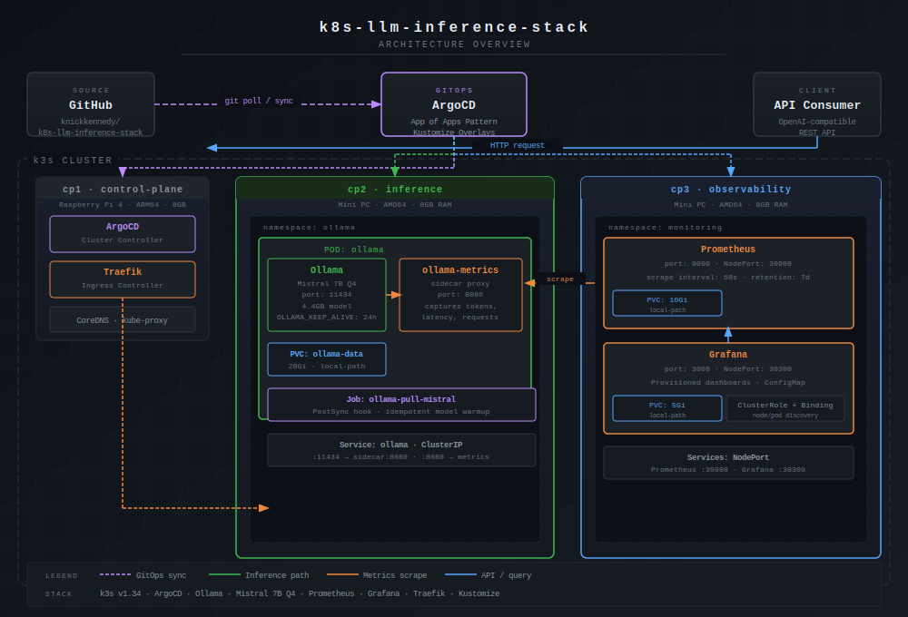

# k8s-llm-inference-stack

A production-grade, GitOps-managed LLM inference stack running on a bare-metal k3s cluster.

## Stack
- **Inference**: Ollama (Mistral 7B Q4) on dedicated inference node
- **Orchestration**: Kubernetes (k3s) with node-pinned workloads
- **GitOps**: ArgoCD for declarative, git-driven deployments
- **Observability**: Prometheus + Grafana with inference-specific dashboards
- **Gateway**: Nginx API gateway with rate limiting

## Cluster Architecture
- `cp1` — Control plane (Raspberry Pi 4, ARM64)
- `cp2` — Inference node (Mini PC, AMD64, 8GB RAM)
- `cp3` — Observability node (Mini PC, AMD64, 8GB RAM)

## Getting Started
Documentation in progress. See `bootstrap/` for cluster setup.

## Performance Benchmarks

### Hardware
| Node | Role | CPU | RAM | GPU |
|------|------|-----|-----|-----|
| cp1 (Pi 4) | Control Plane | ARM64 4-core | 8GB | None |
| cp2 (Mini PC) | Inference | AMD64 | 8GB | None |
| cp3 (Mini PC) | Observability | AMD64 | 8GB | None |

### Inference Latency (Mistral 7B Q4 - CPU only)
| Metric | Value |
|--------|-------|
| First token latency | ~15s |
| Total response time (1 sentence) | ~30s |
| Tokens per second | ~2-4 tok/s |

> **Note:** This stack is designed to demonstrate production-grade Kubernetes infrastructure patterns. 
> GPU acceleration via the NVIDIA GPU Operator (as deployed in production on H100/A100 hardware) 
> reduces inference latency to under 1 second for the same queries.

## Prerequisites

Before deploying the monitoring stack, you must manually create the Grafana admin secret. This secret is intentionally excluded from the repository to prevent credential exposure.
```bash
kubectl create secret generic grafana-secret \
  --from-literal=admin-password=<your-strong-password> \
  --namespace monitoring
```

> **Note:** The `monitoring` namespace must exist before creating the secret. If deploying manually before ArgoCD sync, create it first:
> ```bash
> kubectl create namespace monitoring
> ```
> ArgoCD will create the namespace automatically on first sync if you prefer to let it manage the deployment.

## Secrets Management

This repository follows a **GitOps-safe secrets policy**:

- No secrets or credentials are ever committed to this repository
- Secrets are created manually via `kubectl create secret` before ArgoCD sync
- The following files are explicitly excluded via `.gitignore`:
  - `apps/monitoring/grafana-secret.yaml`
  - Any `*.pem`, `*.key`, `id_*` files

If you fork this repo, audit your commits before making the repository public.

## Documentation

| Document | Description |
|----------|-------------|
| [Troubleshooting](docs/troubleshooting.md) | Common issues and fixes encountered during setup |

## Architecture


